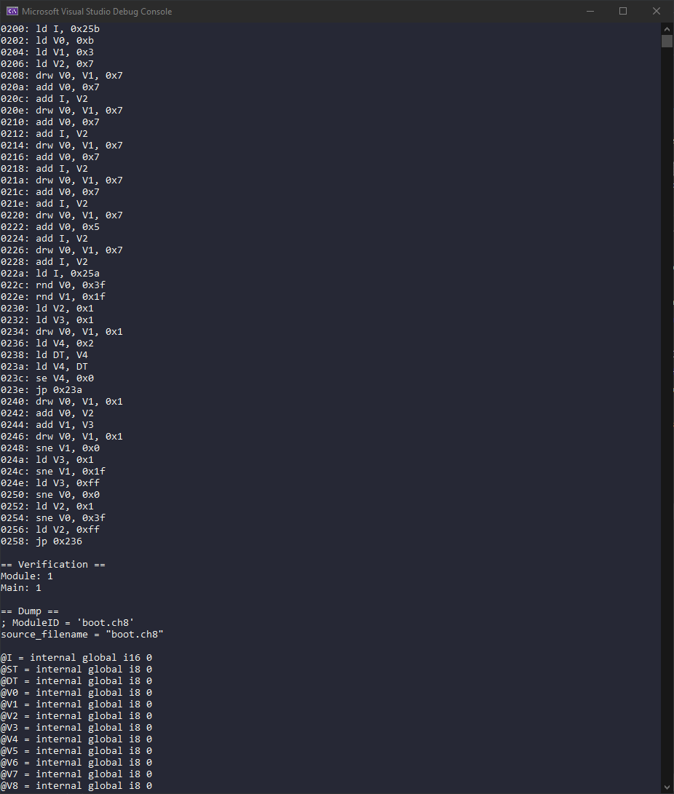
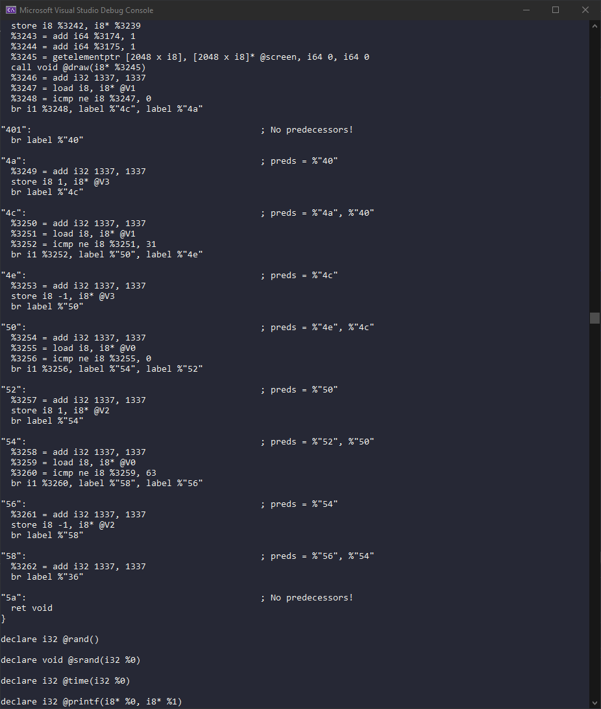
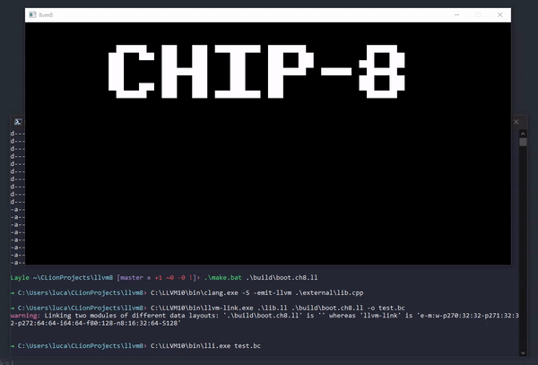

# llvm8
Lifting CHIP8 to LLVM and recompiling to any architecture.

## What is this?
`llvm8` aims to lift a CHIP8 ROM to LLVM which gives us the capability to recompile the ROM to any LLVM-supported architecture. This allows us to run old ROMs without the use of emulation. This is also called static recompilation.

## How does it work?
Here's a rough overview of what is going on:

1. Disassemble ROM file
2. Lift instructions to LLVM
3. Write original ROM file to a global array in the LLVM bitcode
4. Simulate CHIP8 architecture registers through global variables
5. Link against `external/lib.cpp` which contains GUI code and general high level handlers for the ROM

## How do I build this?
Download [this](https://github.com/LLVMParty/LLVMCMakeTemplate) LLVM distribution created by [mrexodia](https://github.com/mrexodia). I installed the files to `C:\LLVM10\`, if you use a different path make sure to change the path below and the paths set in `make.bat` and `make.sh`.

```sh
git clone https://github.com/ioncodes/llvm8
cd llvm8
mkdir build && cd build
cmake -DCMAKE_PREFIX_PATH=C:/LLVM10 ..
```

Open up the solution in your IDE and build it! The binary is called `llvm8{.exe}`.

## How do I use this?
`llvm8` requires you to tell it which bytes are actually executable instructions (and not data), you can do so by providing a comma seperated list to `--code`. When in doubt just use `0-{FILE_SIZE_HERE}`. To find out the code paths use any CHIP8 disassembler or [this](https://github.com/massung/CHIP-8) emulator. To recompile a ROM execute the following command:

```sh
# this assumes that llvm8.exe is placed in the project root folder.
llvm8.exe --rom ./roms/boot.ch8 --code "0-88"
```

This will write a new file called `boot.ch8.ll`. To recompile this to Windows or macOS use the `make.bat` and `make.sh` scripts respectively:

```sh
make.bat boot.ch8.ll
```

This will recompile it to a native image and start it up for debugging purposes.

## What is missing?
A lot of instructions are currently missing (for example `call` & `ret`). I used a few test ROMs I found online to create a recompiler that works with most test ROMs I used. There is also no keyboard support but implementing that is just a matter of plugging SDLs keyboard support to the ROM registers.  
There's also a bug where the UI can not be created on macOS but you can just enable the `NOGUI` flag in `external/lib.cpp` and it will output to the terminal instead.

## Images?



